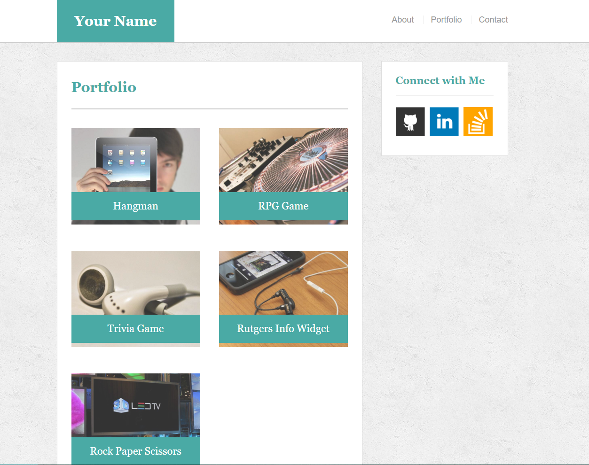

# All right, Bootstrap!

### Overview

For this project I built its layout using the Bootstrap CSS framework. The implementation of Bootstrap is to minimize the use of media queries.

### Screenshots to Replicate

#### About Page

#### Contact Page

#### Projects Page

